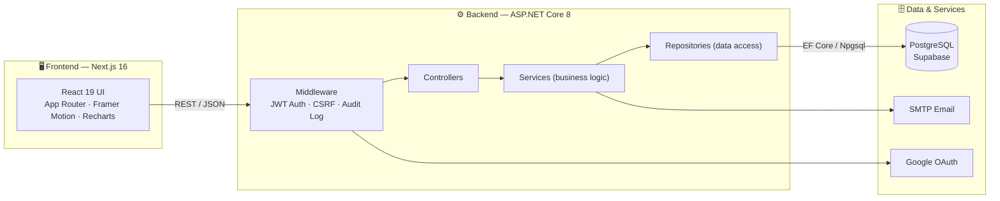

<div align="center">

# 🏆 SEAL Hackathon Platform

### *Software Engineering hackAthon pLatform — from registration to ranking, one connected system.*

Manage events, teams, submissions, judging, and leaderboards for university-scale hackathons — end to end.

<br/>

[](https://nextjs.org/)
[](https://react.dev/)
[](https://www.typescriptlang.org/)
[](https://dotnet.microsoft.com/)
[](https://supabase.com/)

</div>

---

## 📑 Table of Contents

- [Overview](#-overview)
- [Key Features](#-key-features)
- [Tech Stack](#-tech-stack)
- [Architecture](#-architecture)
- [Project Structure](#-project-structure)
- [Getting Started](#-getting-started)
- [Environment Configuration](#-environment-configuration)
- [API Documentation](#-api-documentation)
- [Roles & Permissions](#-roles--permissions)
- [Feature Matrix](#-feature-matrix)
- [Roadmap](#-roadmap)
- [Team](#-team)

---

## 🎯 Overview

**SEAL** is a full-stack platform for running software-engineering hackathons at university scale. It covers the entire competition lifecycle:

> **Register → Form teams → Submit → Judge → Rank → Award**

Organizers create events, configure rounds and judging criteria, and assign judges & mentors. Participants form teams, register for tracks, and submit their work. Judges score submissions against weighted criteria, and the system automatically computes rankings, detects scoring consistency, and publishes results — all in real time.

---

## ✨ Key Features

<table>
<tr>
<td width="50%" valign="top">

**🔐 Authentication & Accounts**
- Email/password + Google OAuth sign-in
- JWT-based sessions with refresh
- Role-based access (Admin, Judge, Mentor, User)
- Password reset & profile management

**📅 Event & Round Management**
- Create events with multiple rounds & tracks
- Configurable deadlines, promotion rules & thresholds
- Judge assignment per round
- Poster & prize configuration

**👥 Team & Matchmaking**
- Create/join teams, invite members
- Register teams into tracks/categories
- Mentor support & matchmaking to find teammates

</td>
<td width="50%" valign="top">

**📤 Submissions & Documents**
- Submit repo / demo / report links
- Document upload, preview & cloud storage
- Edit submissions before deadline
- Full submission history

**⚖️ Judging & Scoring**
- Weighted criteria-based scoring
- Judge feedback & score locking
- Automatic ranking generation
- **ICC** inter-rater consistency analysis
- CSV export of anonymized scores

**📊 Results & Insights**
- Live leaderboards & official results
- Award management & announcements
- Admin analytics & audit logs
- 🤖 AI chatbot for rules & guidance

</td>
</tr>
</table>

---

## 🛠 Tech Stack

<div align="center">

| Layer | Technologies |
|-------|-------------|
| **Frontend** | Next.js 16 (App Router) · React 19 · TypeScript · Framer Motion · Recharts · Ant Design · Lucide Icons |
| **Backend** | ASP.NET Core (.NET 8) · Entity Framework Core 8 · ASP.NET Identity · JWT Bearer · AutoMapper · FluentValidation |
| **Database** | PostgreSQL (Supabase) via Npgsql · Transaction-mode connection pooling |
| **Auth** | JWT · Google OAuth · BCrypt password hashing |
| **Tooling** | Swagger / Swashbuckle · ESLint · EF Core Migrations |

</div>

---

## 🏗 Architecture



The backend follows a clean **Controller → Service → Repository** layering with DTOs and AutoMapper, keeping business logic isolated from data access and HTTP concerns.

---

## 📁 Project Structure

```
SWP391/
├── seal-hackathon-fe/            # Next.js frontend
│   ├── src/
│   │   ├── app/                  # App Router pages & routes
│   │   ├── components/           # Feature components (auth, landing, dashboard, …)
│   │   └── lib/                  # API client & helpers
│   └── public/images/            # Media assets (banners, illustrations)
│
└── seal-hackathon-be/            # ASP.NET Core backend
    ├── Controllers/              # REST endpoints (Events, Teams, Scores, …)
    ├── Services/                 # Business logic
    ├── Repositories/             # EF Core data access
    ├── Models/ · DTOs/           # Entities & data transfer objects
    ├── Middleware/               # JWT, CSRF, audit logging
    ├── Migrations/               # EF Core schema migrations
    └── appsettings.json          # Configuration (use User Secrets for prod!)
```

---

## 🚀 Getting Started

### Prerequisites

- **Node.js** 20+ and npm
- **.NET SDK** 8.0+
- A **PostgreSQL** database (or a Supabase project)

### 1️⃣ Backend — `seal-hackathon-be`

```bash
cd SWP391/seal-hackathon-be

# Restore & build
dotnet restore

# Apply database migrations
dotnet ef database update

# Run the API (https://localhost:7266)
dotnet run
```

Swagger UI will be available at **`https://localhost:7266/swagger`**.

### 2️⃣ Frontend — `seal-hackathon-fe`

```bash
cd SWP391/seal-hackathon-fe

# Install dependencies
npm install

# Start the dev server (http://localhost:3000)
npm run dev
```

Open **[http://localhost:3000](http://localhost:3000)** in your browser. 🎉

---

## 🔧 Environment Configuration

> [!WARNING]
> **Never commit real secrets.** Move connection strings, JWT keys, OAuth credentials, and SMTP passwords out of `appsettings.json` and into **User Secrets** or environment variables for anything beyond local development.

**Backend** (`appsettings.json` / User Secrets):

| Key | Description |
|-----|-------------|
| `ConnectionStrings:DefaultConnection` | PostgreSQL/Supabase connection string (use the **transaction pooler**, port `6543`) |
| `Jwt:Key` | Signing key (≥ 32 chars, never the placeholder in production) |
| `Google:ClientId` | Google OAuth client ID |
| `Email:Smtp:*` | SMTP host / credentials for transactional email |

> 💡 **Connection pooling tip:** When using the Supabase pooler, prefer transaction mode (`Port=6543`) with `Maximum Pool Size`, `No Reset On Close=true`, and `Max Auto Prepare=0` to avoid exhausting the session-mode client limit.

---

## 📖 API Documentation

Interactive API docs are auto-generated with **Swagger**. With the backend running, browse to:

```
https://localhost:7266/swagger
```

Representative endpoint groups: `Auth`, `Events`, `Rounds`, `Categories`, `Teams`, `Submissions`, `Scores`, `Ranking`, `JudgeAssignments`, `Mentor`, `Matchmaking`, `Notifications`, `Prizes`, `Documents`, and `Admin*` (analytics, audit logs, users, teams).

---

## 👤 Roles & Permissions

| Role | Capabilities |
|------|-------------|
| **🛡️ Admin** | Create/manage events, tracks, judges, prizes; publish results; view analytics & audit logs |
| **⚖️ Judge** | Score submissions, leave feedback, lock scores, view assigned rounds |
| **🧭 Mentor** | Support and preview assigned teams |
| **👨‍💻 User / Team** | Register, form/join teams, submit projects, track results |
| **👋 Guest** | Browse public events, register an account |

---

## 🗂 Feature Matrix

<details>
<summary><b>Click to expand the full feature specification</b></summary>

### 1. Authentication & User Profile
| Code | Description | Actor |
| --- | --- | --- |
| FE-AUTH-01 | Register a new account with email and password | Guest |
| FE-AUTH-02 | Login and logout of the system | User, Admin |
| FE-AUTH-03 | Reset password and email | Guest, User |
| FE-AUTH-04 | View & update profile, account & notification settings | User, Admin |

### 2. Dashboard & General
| Code | Description | Actor |
| --- | --- | --- |
| FE-DASH-01 | Dashboard overview (main landing after login) | User, Admin, Judge, Mentor |
| FE-DASH-03 | Per-user notifications | User, Judge, Mentor, Admin |
| FE-DASH-04 | System-wide notifications | Admin |
| FE-DASH-05 | Theme & language switching | User |

### 3. Document Management
| Code | Description | Actor |
| --- | --- | --- |
| FE-DOC-01 | Upload documents | User |
| FE-DOC-02 | Search / list documents with filters | User, Judge, Admin |
| FE-DOC-03 | View document detail | User, Judge, Admin |
| FE-DOC-04 | Edit document metadata | User, Admin |
| FE-DOC-05 | Delete document | User, Admin |
| FE-DOC-06 | Download document | User, Judge, Mentor |
| FE-DOC-07 | Share document | User, Admin |

### 4. Cloud Storage
| Code | Description | Actor |
| --- | --- | --- |
| FE-CLD-01 | Upload to cloud | System, User |
| FE-CLD-02 | Upload progress indicator | User |
| FE-CLD-03 | Preview document before submitting | User, Judge, Mentor |

### 5. Event Management
| Code | Description | Actor |
| --- | --- | --- |
| FE-EVT-01 | Create event | Admin |
| FE-EVT-02 | Manage & update event info | Admin |
| FE-EVT-03 | Create rounds | Admin |
| FE-EVT-04 | Configure rounds | Admin |
| FE-EVT-05 | Promotion rules | Admin |
| FE-EVT-06 | Judge assignment | Admin |
| FE-EVT-07 | Deadline configuration | Admin |

### 6. Track / Category Management
| Code | Description | Actor |
| --- | --- | --- |
| FE-TRC-01 | Create track | Admin |
| FE-TRC-02 | Assign mentors to a track | Admin |
| FE-TRC-03 | Manage categories | Admin |

### 7. Team Management
| Code | Description | Actor |
| --- | --- | --- |
| FE-TEA-01 | Create team | User |
| FE-TEA-02 | Invite members | Leader |
| FE-TEA-03 | Register team into a track | Leader |
| FE-TEA-04 | Manage team info | Leader |
| FE-TEA-05 | Kick member | Leader |
| FE-TEA-06 | Leave team | Member |
| FE-TEA-07 | Preview & support team | Mentor |

### 8. Submission Management
| Code | Description | Actor |
| --- | --- | --- |
| FE-SUB-01 | Submit project repository link | Team Leader |
| FE-SUB-02 | Submit demo link | Team Leader |
| FE-SUB-03 | Submit report / presentation link | Team Leader |
| FE-SUB-04 | Update submission before deadline | Team Leader |
| FE-SUB-05 | View submission history & details | Team Leader, Judge |

### 9. Judging & Scoring
| Code | Description | Actor |
| --- | --- | --- |
| FE-JSRC-01 | Score submissions per criterion | Judge |
| FE-JSRC-02 | Calculate scores using criterion weights | System |
| FE-JSRC-03 | Add feedback comments | Judge |
| FE-JSRC-04 | Finalize & lock scores | Judge |
| FE-JSRC-05 | Generate rankings | System, Admin |
| FE-JSRC-06 | Eliminate rule-violating teams | Admin |
| FE-JSRC-07 | Record system actions (audit) | System |

### 10. Research / Analytics
| Code | Description | Actor |
| --- | --- | --- |
| FE-RSA-01 | Inter-rater consistency analysis (ICC) | Admin |
| FE-RSA-02 | Export anonymized scoring data (CSV) | Judge, Admin |

### 11. Prize & Announcement
| Code | Description | Actor |
| --- | --- | --- |
| FE-PRAN-01 | Award management | Admin |
| FE-PRAN-02 | Publish official results | Admin |
| FE-PRAN-03 | Export ranking | Admin |
| FE-PRAN-04 | Result notifications | Admin, System |

### 12. AI Chatbot
| Code | Description | Actor |
| --- | --- | --- |
| FE-AI-01 | Registration assistance | System |
| FE-AI-02 | Competition rules Q&A | System |
| FE-AI-03 | Prize structure info | System |
| FE-AI-04 | Find teams & mentors | System |

</details>

---

## 🗺 Roadmap

- [x] Core event, team & submission lifecycle
- [x] Weighted judging & automatic ranking
- [x] Google OAuth & role-based access
- [x] Admin analytics & audit logging
- [ ] Real-time notifications (WebSockets)
- [ ] Enhanced AI chatbot with retrieval
- [ ] Public API & webhooks

---

## 👨‍💻 Team

Built by the **SEAL** team for **SWP391** — Software Engineering Project.

<div align="center">

*Innovate. Code. Create. The Future.* ⚡

</div>
